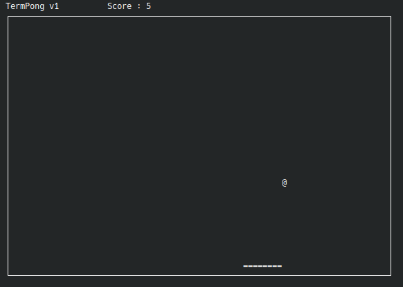

# TermPong
Pong game on terminal!




## Instuctions

- use `a`, `d` keys to move bat left and right respectively.
- use `p` key to pause the game.
- use `q` or `ctrl+c` to exit the game.


## Getting Started

**Install the prerequisites**

```bash
$ sudo apt install libncurses5-dev libncusesw5-dev build-essential
```

**Clone the repo**

```bash
$ git clone https://github.com/saurabhsingh99100/TermPong.git
```

**Run make**

```bash
$ cd TermPong && make
```

**Run the executable**

```bash
$ ./bin/TermPong
```


***That' s it, Have fun!***


